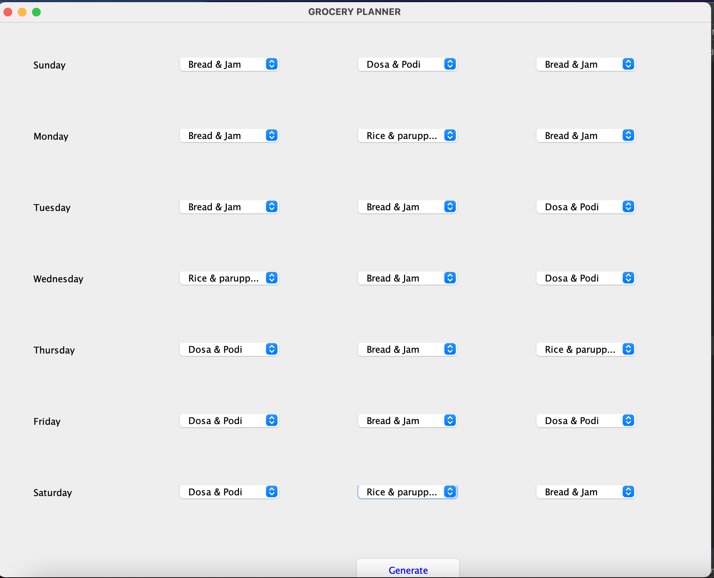
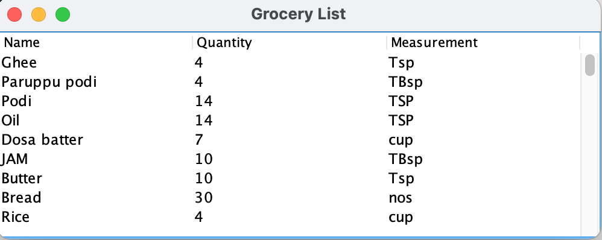

This Grocery_Planner is built using JAVA technology.The basic idea of this project is to plan every week's grocery.
If we select the meals for every day of a week and click "GENERATE" as shown in the first screenshot we can list out the list of groceries along with the quantities.The required list generated is attached in the second screenshot.

Input Window:

Output Window:
